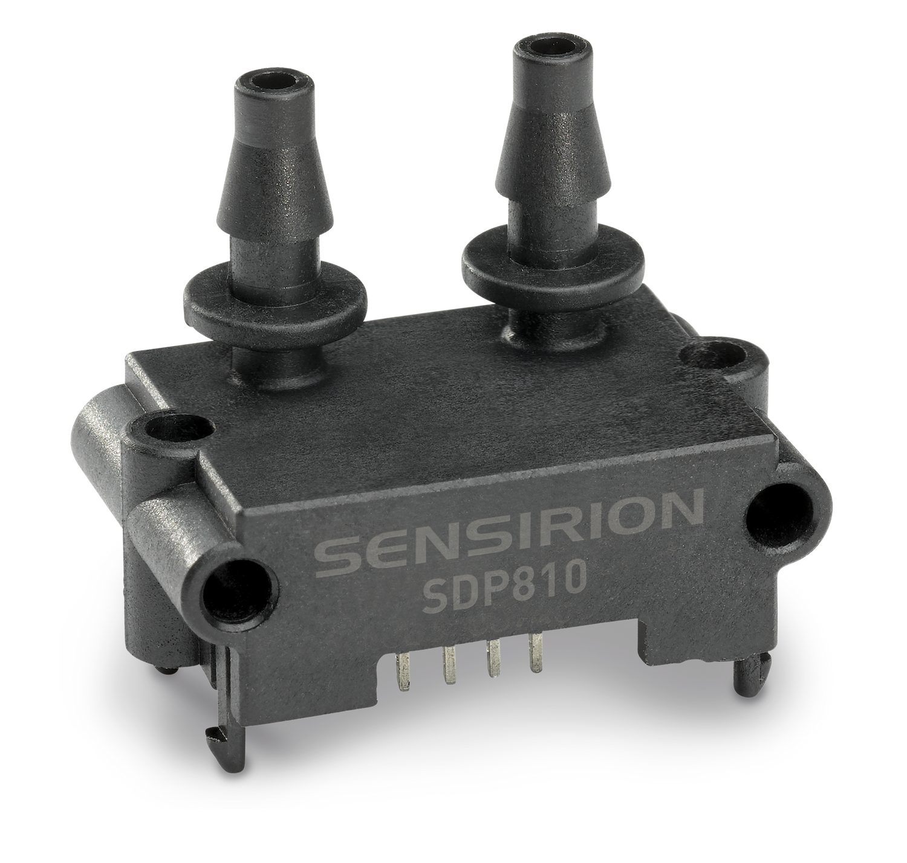
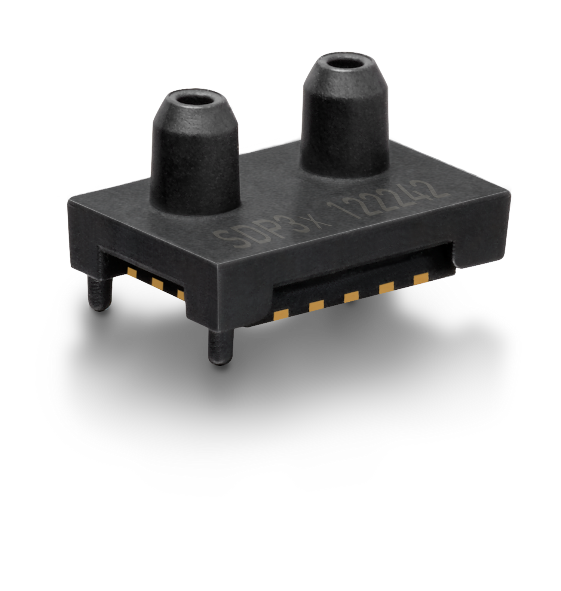
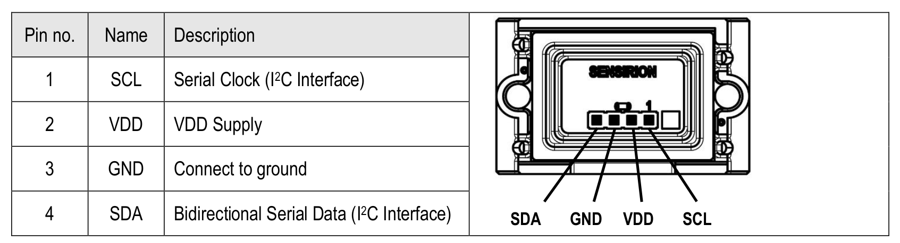

# Sensirion I2C SDP Arduino Library

This is the Sensirion SDP library for Arduino using the
modules I2C interface.

<center></center>

Click [here](https://sensirion.com/products/catalog/EK-P4/) to learn more about the SDP3x Sensor Evaluation Kit.

Click [here](https://sensirion.com/products/catalog/EK-P5/) to learn more about the SDP8xx series Sensor Evaluation Kit.

# Installation

To install, download the latest release as .zip file and add it to your
[Arduino IDE](http://www.arduino.cc/en/main/software) via

    Sketch => Include Library => Add .ZIP Library...

Don't forget to **install the dependencies** listed below the same way via `Add
.ZIP Library`

Note: Installation via the Arduino Library Manager is coming soon.

# Dependencies

- [Sensirion Core](https://github.com/Sensirion/arduino-core)

# Quick Start

1. Connect the SDP Sensor to your Arduino board's standard
   I2C bus. Check the pinout of your Arduino board to find the correct pins.
   The pinout of the SDP Sensor board can be found in the
   data sheet.

   - **VDD** of the SEK-SDP to the **3V3** of your Arduino board (5V is also possible)
   - **GND** of the SEK-SDP to the **GND** of your Arduino board
   - **SCL** of the SEK-SDP to the **SCL** of your Arduino board
   - **SDA** of the SEK-SDP to the **SDA** of your Arduino board

<center></center>

2. Open the `exampleUsage` sample project within the Arduino IDE

   File => Examples => Sensirion I2C SDP => exampleUsage

3. Click the `Upload` button in the Arduino IDE or

   Sketch => Upload

4. When the upload process has finished, open the `Serial Monitor` or `Serial
Plotter` via the `Tools` menu to observe the measurement values. Note that
   the `Baud Rate` in the corresponding window has to be set to `115200 baud`.

# I2C address selection in `exampleUsage`

In the provided `exampleUsage` it is possible to select the I2C address depending on the model of the sensor used.
When using the wrong address the sensor will not answer the I2C requests, resulting in `NACK` errors.
Please find the possible values below:
| constant_name | value |
|---|---|
| SDP8XX_I2C_ADDRESS_0 | 0x25 |
| SDP8XX_I2C_ADDRESS_1 | 0x26 |
| SDP3X_I2C_ADDRESS_0 | 0x21 |
| SDP3X_I2C_ADDRESS_1 | 0x22 |
| SDP3X_I2C_ADDRESS_2 | 0x23 |

# Contributing

**Contributions are welcome!**

We develop and test this driver using our company internal tools (version
control, continuous integration, code review etc.) and automatically
synchronize the master branch with GitHub. But this doesn't mean that we don't
respond to issues or don't accept pull requests on GitHub. In fact, you're very
welcome to open issues or create pull requests :)

This Sensirion library uses
[`clang-format`](https://releases.llvm.org/download.html) to standardize the
formatting of all our `.cpp` and `.h` files. Make sure your contributions are
formatted accordingly:

The `-i` flag will apply the format changes to the files listed.

```bash
clang-format -i src/*.cpp src/*.h
```

Note that differences from this formatting will result in a failed build until
they are fixed.

# License

See [LICENSE](LICENSE).
